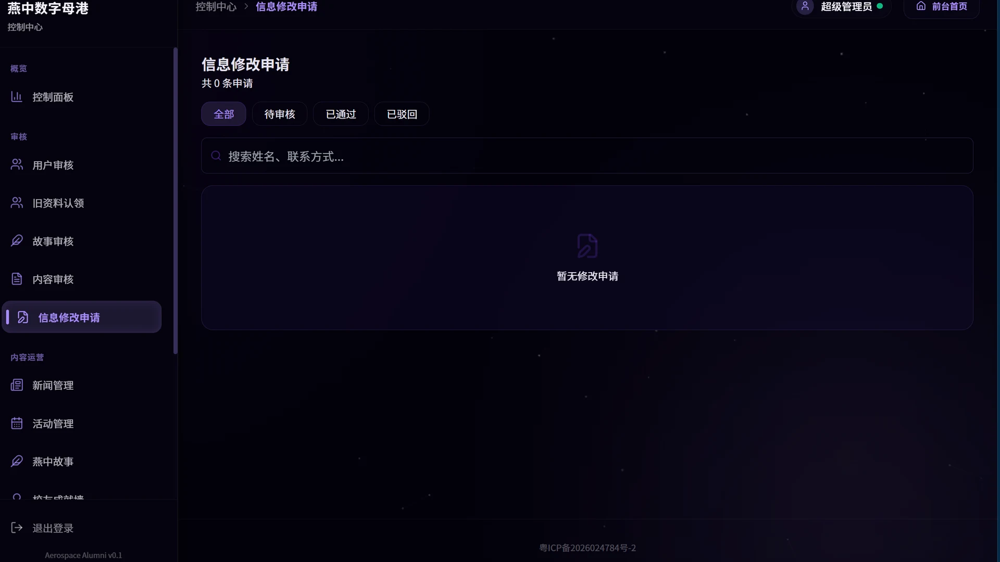
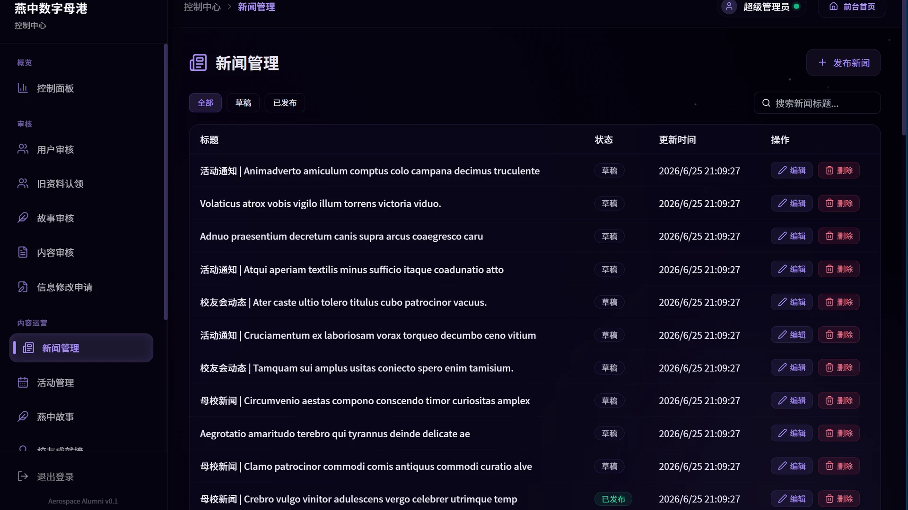
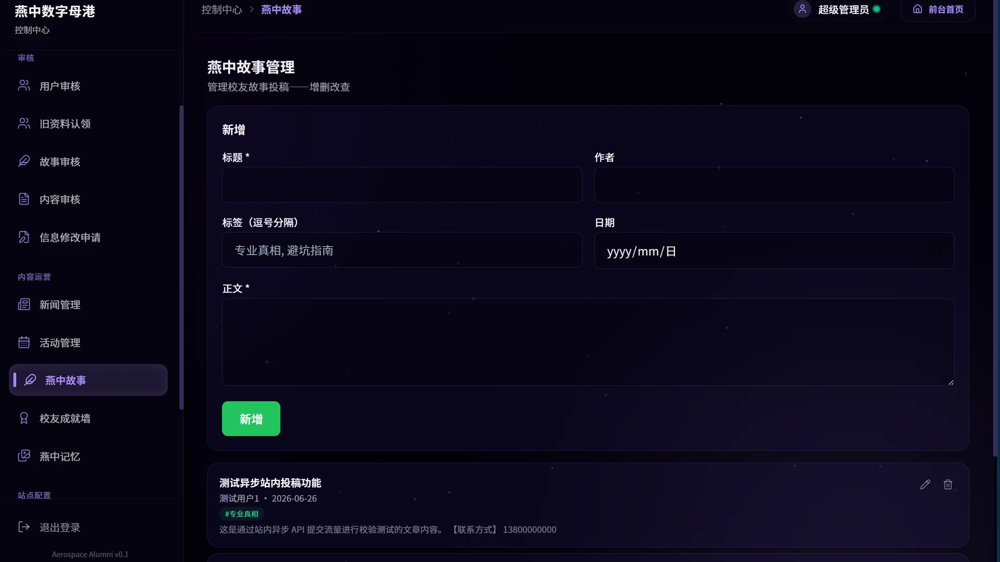
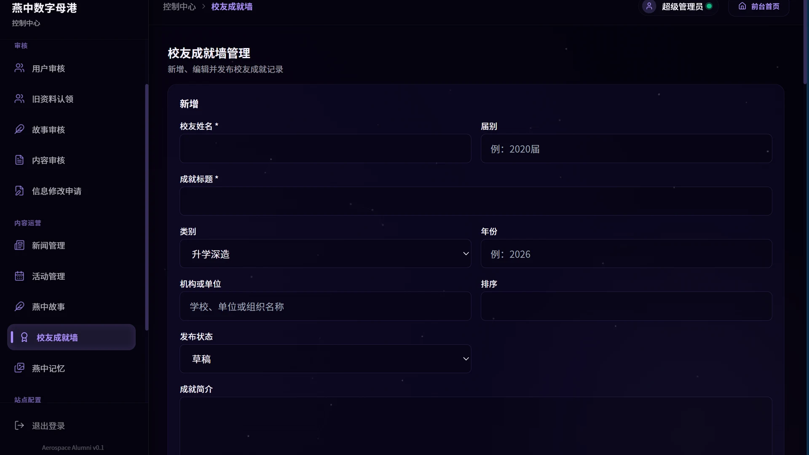
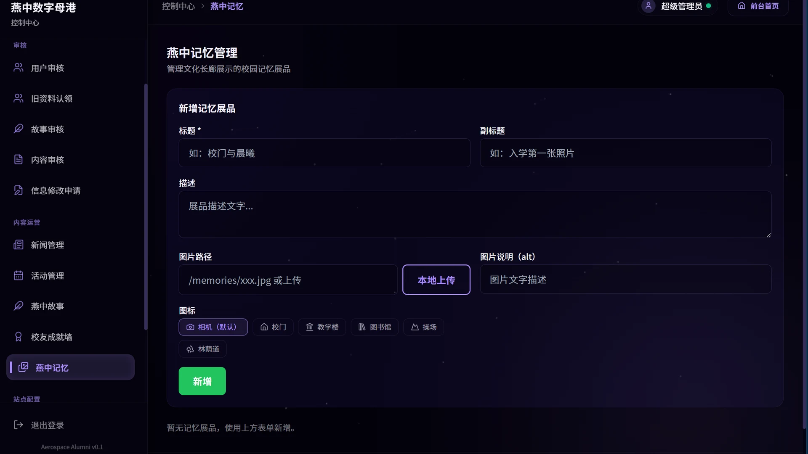
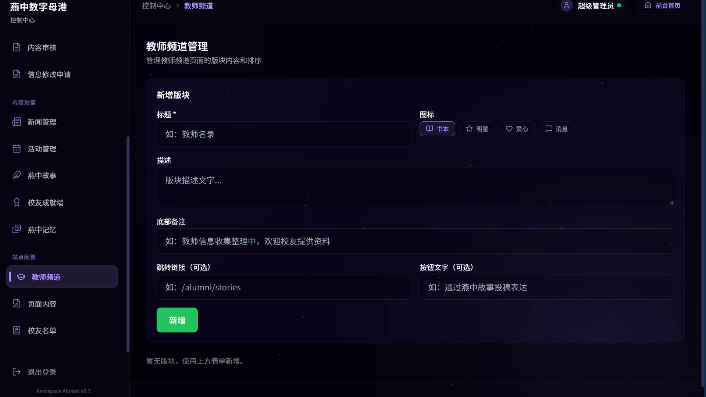
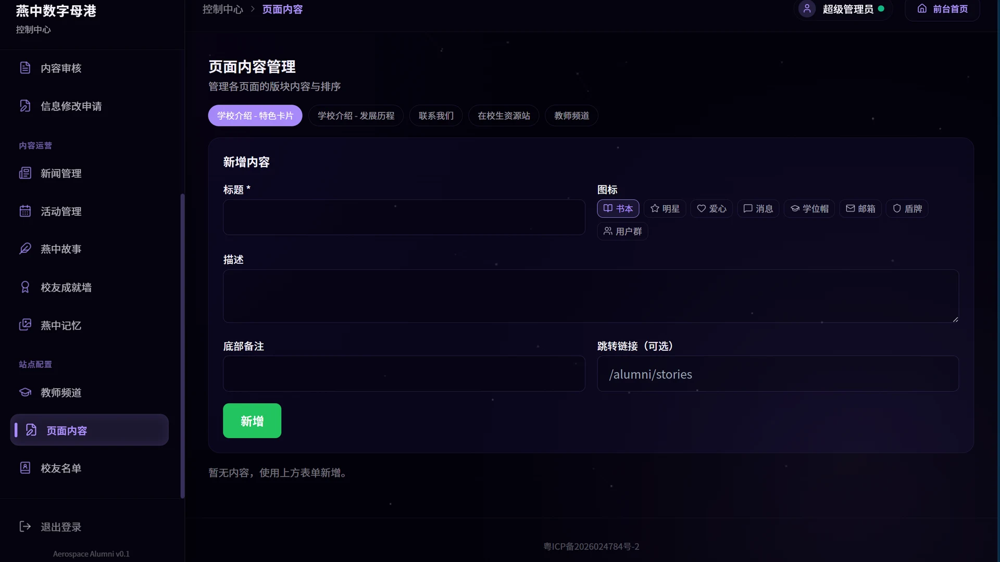

# 🚀 燕中校友数字母港 · Yanzhong Alumni Hub

<p align="center">
  
  
  
  
  
  
</p>

<p align="center">
  <strong>深圳市燕川中学校友会公益数字平台</strong><br />
  连接毕业校友、在校生与老师 · 非官方、无盈利、即将开源共建
</p>

<p align="center">
  <a href="https://yanchuaner.cn">
    
  </a>
  <a href="https://github.com/yanchuaner/web_yanchuaner">
    
  </a>
  
  <a href="./LICENSE">
    
  </a>
</p>

---

## 🌌 Hero — 不只是校友录，而是一座数字母港

你可能见过无数校友录网站。但 **燕中校友数字母港** 是一个面向深圳市燕川中学校友、在校师生与管理员的**全栈数字化社区操作系统**。V2.0 版本经历了从「能跑」到「生产级」的质变——我们重建了安全防线、实现了站内 CMS 审核闭环、赋予了系统星空紫暗黑玻璃拟态的设计灵魂，并以幂等性数据播种工作流兜底了零停机部署。

> **One-command to start. One pipeline to deploy. Zero OOM on the edge.**

---

## 📸 平台视觉

### 🏛️ 前台大堂

| | | |
|:---:|:---:|:---:|
| [](docs/assets/screenshots/about.webp) | [](docs/assets/screenshots/news.webp) | [](docs/assets/screenshots/events.webp) |
| **百年燕中（学校介绍）** | **校园公告与新闻资讯** | **校友活动** |
| [](docs/assets/screenshots/students.webp) | [](docs/assets/screenshots/teachers.webp) | [](docs/assets/screenshots/contact.webp) |
| **在校生互助资源站** | **筑梦师长（教师频道）** | **互通有无（联系我们）** |

### 🚀 校友专属空间

| | | |
|:---:|:---:|:---:|
| [](docs/assets/screenshots/alumni-contact.webp) | [](docs/assets/screenshots/alumni-achievements.webp) | [](docs/assets/screenshots/alumni-stories.webp) |
| **星空通讯录（校友地图）** | **校友成就墙** | **燕中故事专栏 (CMS)** |
| [](docs/assets/screenshots/alumni-memories.webp) | [](docs/assets/screenshots/alumni-certificate.webp) | |
| **燕中记忆文化长廊** | **电子校友纪念卡** | |

<details>
<summary><b>🛠️ 管理员后台（点击展开 14 张截图）</b></summary>

<br />

| | | |
|:---:|:---:|:---:|
| [](docs/assets/screenshots/admin-dashboard.webp) | [](docs/assets/screenshots/admin-news.webp) | [](docs/assets/screenshots/admin-events.webp) |
| **控制台概览** | **新闻管理** | **活动管理** |
| [](docs/assets/screenshots/admin-alumni.webp) | [](docs/assets/screenshots/admin-corrections.webp) | [](docs/assets/screenshots/admin-memories.webp) |
| **校友名单管理** | **修改申请审核** | **燕中记忆管理** |
| [](docs/assets/screenshots/admin-stories.webp) | [](docs/assets/screenshots/admin-stories-pending.webp) | [](docs/assets/screenshots/admin-posts.webp) |
| **燕中故事管理** | **待审核故事工作台** | **投稿管理** |
| [](docs/assets/screenshots/admin-users.webp) | [](docs/assets/screenshots/admin-claims.webp) | [](docs/assets/screenshots/admin-achievements.webp) |
| **用户管理** | **旧资料认领审核** | **校友成就墙管理** |
| [](docs/assets/screenshots/admin-teachers.webp) | [](docs/assets/screenshots/admin-content.webp) | |
| **教师频道管理** | **页面内容管理** | |

</details>

---

## ✨ 核心特性矩阵

| 特性 | 描述 |
|------|------|
| 🛡️ **工业级安全防护** | HMAC-SHA256 + timingSafeEqual 防时序攻击 · 三层限流自动降级（Upstash → ioredis → Memory）· Payload 16KB 熔断器防 OOM · `sessionVersion` 即时全局踢出 |
| 🌌 **星空紫暗黑玻璃拟态** | 全局 Tailwind 语义设计令牌 · `backdrop-blur-xl` 毛玻璃卡片 · 3 级阴影系统 · 暗黑主题贯穿前台与后台 |
| 🗺️ **多维校友地图聚合** | Leaflet 热力地图 · 城市/院校/专业三维聚合算法 · `cityCoordinates` 静态离线坐标系 · 实时校友搜索与分布统计 |
| 📝 **站内 CMS 审核闭环** | `DRAFT → PENDING → PUBLISHED/REJECTED` 四态状态机 · 前台「我的投稿」面板支持状态追踪与撤销 · 后台审核工作台含完整审计日志 |
| ⚙️ **自动化全链路部署** | Prisma 幂等种子脚本 · `build` 命令自动建表+播种 · systemd + Nginx + Let's Encrypt · WAL 模式 SQLite 事务优化 |
| 🎨 **前端工程化解耦** | `useResource` + `CrudManager` 数据层抽象 · 基础组件库（GlassCard/PageShell/Badge/PageHeader）· `JoinRequestModal` 全局单例弹窗 |
| 📤 **智能图片管道** | Sharp 16:9 自动裁切 + WebP 转换 · 原子写入（tmp→rename）防文件损坏 · 上传 MIME 类型安全校验 |
| 📊 **操作审计追溯** | 管理员所有关键操作自动写入 `AuditLog` · JSON before/after 快照 · 按目标类型 & 时间双索引检索 |

---

## 🏗️ 架构概览

```
┌──────────────────────────────────────────────────────────┐
│                      Nginx Reverse Proxy                  │
│                   (HTTPS / Let's Encrypt)                 │
└──────────────────┬───────────────────────────────────────┘
                   │
     ┌─────────────▼─────────────┐
     │   Next.js 14.2 (Standalone)│
     │   ┌─────────────────────┐ │
     │   │  Middleware (Edge)  │ │  ← Token 验签 + 路由守卫
     │   │  HMAC-SHA256 verify │ │
     │   └────────┬────────────┘ │
     │            │               │
     │   ┌────────▼────────────┐ │
     │   │  21 × Front Pages   │ │  ← 前台：首页/地图/故事/校友证
     │   │  18 × Admin Pages   │ │  ← 后台：审核/管理/配置
     │   │  40+ API Routes     │ │  ← REST：鉴权→payload校验→业务
     │   └────────┬────────────┘ │
     └────────────┼──────────────┘
                  │
     ┌────────────▼────────────┐
     │   Prisma 7.x + SQLite   │
     │   ┌─────────────────┐   │
     │   │  WAL Mode        │   │  ← 并发读 / 批量事务写
     │   │  busy_timeout=5s │   │
     │   └─────────────────┘   │
     │   16 Models · 50+ Index │
     └─────────────────────────┘
     ┌─────────────────────────┐
     │  Upstash Redis (可选)   │  ← 限流加速 / 缓存
     │  ioredis (可选)         │  ← 自建 Redis 退路
     │  Memory Map (保底)      │  ← 单机兜底
     └─────────────────────────┘
```

### 技术选型哲学

> **Lightweight by design, robust by defense.**  
> SQLite 单文件数据库避免了运维 MySQL/Postgres 的复杂性；WAL 模式 + 事务批量写 + `busy_timeout` 三重优化使它在并发场景下仍然可靠。  
> Standalone 编译输出意味着零 Node.js 运行时依赖——一台 2C2G 的 Linux 服务器足以驱动数百校友的日常访问。

---

## 🚀 快速开始

### 前置条件

- **Node.js** ≥ 20.x
- **npm** ≥ 10.x
- **WSL / Linux**（生产构建需 Unix 环境）

### 一条命令启动开发环境

```bash
git clone https://github.com/yanchuaner/web_yanchuaner.git
cd web_yanchuaner
npm ci
cp .env.example .env   # 编辑 .env 配置环境变量
npm run build           # Prisma generate → db push → seed → next build
npm run dev
```

浏览器访问 `http://localhost:3000` 即可预览。

> **`npm run build` 做了什么？**  
> `prisma generate && prisma db push && prisma db seed && next build`  
> 一条命令完成：类型生成 → 数据库建表 → 种子数据注入 → 生产编译。这就是我们说的「幂等性数据播种工作流」——无论执行多少次，数据都安全无损。

### 初始化管理员账号

```bash
npm run create-admin
# 按提示输入用户名和密码，即可获得后台管理权限
```

### 环境变量速查

| 变量 | 说明 |
|------|------|
| `DATABASE_URL` | SQLite 数据库路径（如 `file:./prisma/dev.db`） |
| `SESSION_SECRET` | Token 签名密钥 · 至少 32 字符随机串 |
| `ACCESS_PASSWORD_HASH` | 访问口令（SHA256 哈希） |
| `ADMIN_USERNAME` / `ADMIN_PASSWORD_HASH` | 管理员账号 |
| `UPLOAD_DIR` | 图片上传目录，默认 `public/uploads` |
| `RESEND_API_KEY` / `RESEND_FROM_EMAIL` | 邮件服务（Resend） |
| `UPSTASH_REDIS_REST_URL` / `UPSTASH_REDIS_REST_TOKEN` | 云端限流（可选） |
| `REDIS_URL` | 自建 Redis（可选） |

---

## 📂 项目结构

```text
aerospace-alumni-site/
├── src/
│   ├── app/                          # Next.js App Router 主阵地
│   │   ├── (front)/                  # 前台路由组（21 页）
│   │   │   ├── page.tsx              # 星空大堂（首页）
│   │   │   ├── about/                # 百年燕中
│   │   │   ├── alumni/               # 校友专属空间
│   │   │   │   ├── university-map/   #   🗺️ 校友城市热力地图
│   │   │   │   ├── stories/          #   📝 校友故事专栏
│   │   │   │   ├── certificate/      #   🎓 电子校友纪念卡
│   │   │   │   ├── achievements/     #   🏆 校友成就榜
│   │   │   │   ├── memories/         #   📸 青春记忆馆
│   │   │   │   └── correction/       #   ✏️ 校友名录修正
│   │   │   ├── students/             # 在校生资源站
│   │   │   ├── teachers/             # 筑梦师长
│   │   │   ├── news/                 # 新闻资讯
│   │   │   ├── events/               # 活动公告
│   │   │   └── me/                   # 个人中心（资料+投稿管理）
│   │   ├── (admin)/admin/            # 后台路由组（18 页）
│   │   │   ├── page.tsx              # 控制台概览
│   │   │   ├── stories/pending/      # 审核工作台
│   │   │   ├── alumni/               # 校友名册管理（含 CSV 导入）
│   │   │   ├── users/                # 用户管理
│   │   │   ├── user-claims/          # 校友认领审核
│   │   │   └── ...                   # 内容/活动/成就/记忆管理
│   │   └── api/                      # 60+ API 端点（鉴权→校验→业务）
│   ├── components/
│   │   ├── ui/                       # 原子级 UI 组件
│   │   │   ├── PageShell.tsx         #   页面容器（导航+页脚包裹）
│   │   │   ├── GlassCard.tsx         #   毛玻璃卡片基座
│   │   │   ├── PageHeader.tsx        #   页面标题（eyebrow+描述）
│   │   │   ├── Button.tsx            #   语义按钮（variant/size）
│   │   │   ├── Badge.tsx             #   状态徽章
│   │   │   ├── EmptyState.tsx        #   空状态占位
│   │   │   ├── RevealSection.tsx     #   滚动渐入动画
│   │   │   └── InteractiveStarfield.tsx # 🎆 星空粒子背景
│   │   └── admin/                    # 后台组件
│   │       ├── AdminPageShell.tsx    #   后台页面壳
│   │       ├── AdminBreadcrumb.tsx   #   面包屑导航
│   │       └── CrudManager.tsx       #   通用 CRUD 表格组件
│   ├── hooks/
│   │   └── useResource.ts            # 数据层抽象 Hook
│   ├── lib/                          # 核心工具库
│   │   ├── db.ts                     #   Prisma 客户端（WAL+timeout）
│   │   ├── verify-token.ts           #   HMAC-SHA256 Token 签名/校验
│   │   ├── admin-auth.ts             #   RBAC 鉴权中间件（API/Page 双模式）
│   │   ├── auth-utils.ts             #   密码规范/Payload 熔断器/安全跳转
│   │   ├── rate-limit.ts             #   三层限流器（Upstash→ioredis→Memory）
│   │   ├── cache.ts                  #   Redis 缓存层（可选）
│   │   ├── image-pipeline.ts         #   Sharp 16:9 智能裁切管道
│   │   ├── tags.ts                   #   Tags 解析/标准化工具
│   │   ├── email.ts                  #   Resend 邮件服务
│   │   ├── apiClient.ts              #   前台 fetch 客户端封装
│   │   └── memories.ts              #   记忆数据工具
│   └── middleware.ts                 # Edge 路由守卫（Token 验签+路由分流）
├── prisma/
│   ├── schema.prisma                 # 16 个数据模型 + 50+ 索引
│   ├── seed.ts                       # 幂等性种子脚本
│   └── data/                         # 种子数据源（CSV/JSON）
├── scripts/                          # 运维脚本（备份/加载测试/数据迁移/种子）
├── docs/                             # 技术文档矩阵
│   ├── architecture.md               #   架构设计详解（请求生命周期、数据解耦、地图聚合）
│   ├── security.md                   #   安全防御指南（Payload 熔断、IDOR、Token 设计）
│   ├── deployment.md                 #   部署流水线指南（systemd、Nginx、CI/CD）
│   ├── ui-guide.md                   #   UI 开发指南（设计令牌、组件库、星空紫主题）
│   ├── routes.md                     #   全量路由清单（60+ API + 状态机路由标注）
│   ├── admin-guide.md                #   管理员手册（CMS 审核工作台、审计日志）
│   ├── operations-guide.md           #   运营指南（SQLite WAL、幂等播种、限流架构）
│   └── troubleshooting.md            #   故障排除（SQLITE_BUSY、429、构建问题）
├── tailwind.config.ts                # 语义设计令牌定义
└── Dockerfile                        # 多阶段 Standalone 容器构建
```

---

## 📋 核心日常指令

| 命令 | 说明 |
|------|------|
| `npm run dev` | 启动开发服务（热重载 · 0.0.0.0:3000） |
| `npm run build` | 一站式生产构建（生成→建表→播种→编译） |
| `npm run start` | 启动 Standalone 生产服务 |
| `npm run lint` | ESLint 静态检查 |
| `npm run smoke` | 核心路由安全冒烟测试 |
| `npm run seed` | 幂等种子注入（仅 `prisma/seed.ts`） |
| `npm run seed-all` | 全量种子注入（名册+内容+记忆+故事） |
| `npm run create-admin` | 交互式创建管理员账号 |
| `npm run fresh` | 清理重建开发环境 |
| `npx prisma studio` | 数据库可视化浏览器 |

---

## 🛡️ 安全合规

本项目从 V2.0 起建立了防御性编程基线，核心安全机制包括：

- **Payload 大小熔断**：所有 JSON 请求体受 `readJsonBody()` 限制（普适 16KB / 富文本 512KB），超限直接拒绝，杜绝内存炸弹
- **CSV 导入多层防御**：文件 ≤ 2MB · 智能列头检测 · 逐行字段校验 · 事务批量写入 · 错误上限 20 条即熔断
- **鉴权分层**：Middleware（Edge Token 验签）→ API（`requireAdmin` / `requireVerifiedAlumni`）→ 数据库层（`select` 显式投射脱敏）——三层纵深
- **Token 安全设计**：`sessionVersion` 计数器 + HMAC-SHA256 + `timingSafeEqual`，支持即时全局踢出所有会话
- **限流自动降级**：Upstash Redis → ioredis → Memory Map，任何一层故障均不阻断服务
- **图片安全**：MIME 类型校验 + Sharp 重编码 + 原子写入（tmp→rename）

详见 [`docs/security.md`](./docs/security.md)。

---

## 📐 设计令牌系统

本项目统一使用语义 CSS 类名，**禁止裸写十六进制色值**。

```css
text-brand       /* 主色 #7C3AED */          bg-surface        /* 卡片白 */
bg-brand/10      /* 10% 透明主色 */           bg-surface-muted   /* 页面底色 */
text-accent      /* CTA 绿 */                 border-line        /* 统一描边 */
```

完整的令牌定义见 `src/app/globals.css` 的 `:root` 块 + `tailwind.config.ts`。

---

## 🤝 贡献指南

欢迎所有校友共建者提交 Issue 或 Pull Request！

1. Fork 本仓库，从 `main` 分支创建 Feature 分支
2. 修改后确保通过 `npm run lint`（零警告）
3. 提交 PR 指向 `main` 分支，附上清晰的变更说明

### 关键禁区

| 禁止修改 | 说明 |
|----------|------|
| `src/app/api/*` | 后端 API 端点与数据契约 |
| `prisma/schema.prisma` | 数据库模型定义 |
| `src/lib/db.ts` / `src/lib/admin-auth.ts` / `src/lib/verify-token.ts` | 数据库连接与鉴权核心 |
| `src/middleware.ts` | 路由安全中间件 |
| 所有路由的 folder 名与 `href` | SEO 与外链稳定性 |

---

## 📄 开源协议

本项目采用 [MIT License](./LICENSE) 授权，仅用于个人公益及非商业性校友联络平台构建。

---

<p align="center">
  <sub>Built with ❤️ for Yanzhong Alumni · V2.0 — June 2025</sub>
</p>
