# 燕中校友数字母港

燕中校友数字母港是面向深圳市燕川中学校友、在校生与老师的个人公益数字平台。项目用于校友联络、信息发布、故事投稿、活动管理与校友资料维护，定位为非官方、无盈利的开源共建网站。

当前前端提供亮色/暗色双主题与中英双语界面，首页以轻量 Canvas 星体、校友信号场和内容动效串联“重新连接、看见彼此、长期共建”的访问路径；移动端与减少动态效果偏好均有独立适配。

线上站点：[https://yanchuaner.cn](https://yanchuaner.cn)

仓库地址：[https://github.com/yanchuaner/web_yanchuaner](https://github.com/yanchuaner/web_yanchuaner)

> 本仓库只包含网站代码、公开文档和示例配置，不包含真实数据库、上传文件、账号凭据或校友隐私数据。

## 项目预览

点击截图可查看大图。这里保留少量代表性页面，完整交互以本地运行或线上站点为准。

| 星空通讯录 | 校友故事 | 管理后台 |
| --- | --- | --- |
| [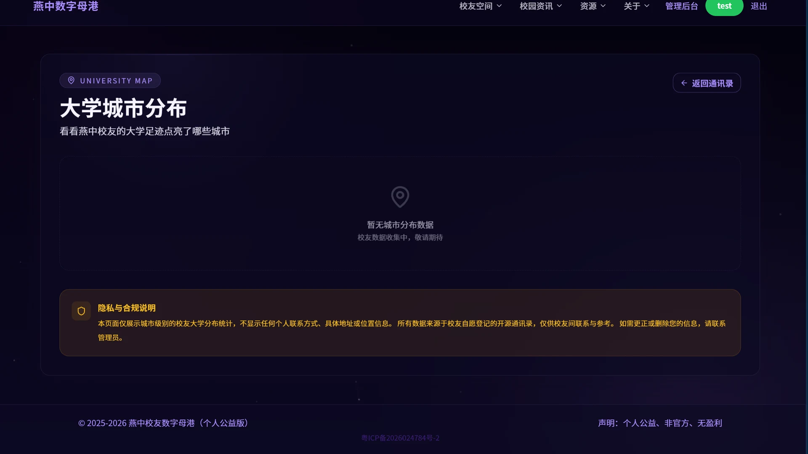](docs/assets/screenshots/alumni-contact.webp) | [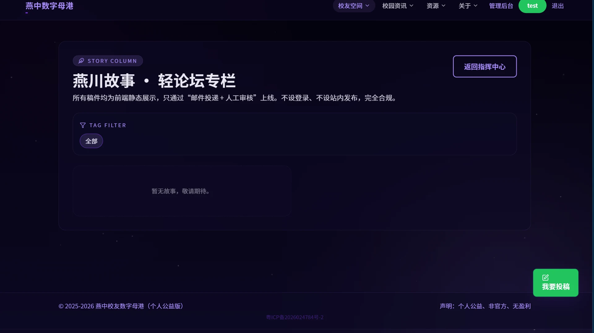](docs/assets/screenshots/alumni-stories.webp) | [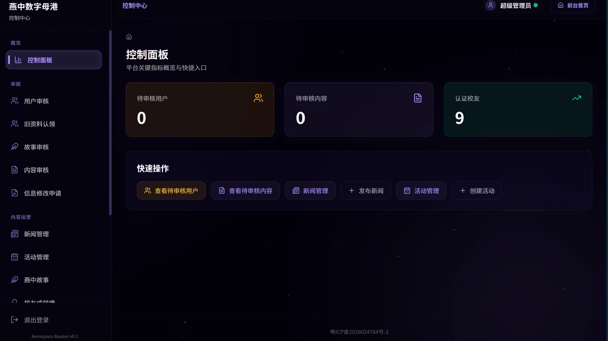](docs/assets/screenshots/admin-dashboard.webp) |
| 校友搜索、城市分布与星空体验 | 故事展示与个人中心投稿 | 后台统计与运营入口 |

<details>
<summary>展开更多前台页面截图</summary>

| 学校介绍 | 新闻公告 | 校友活动 |
| --- | --- | --- |
| [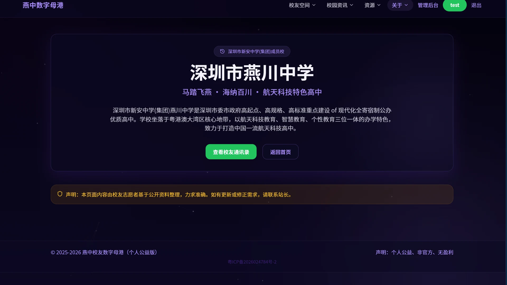](docs/assets/screenshots/about.webp) | [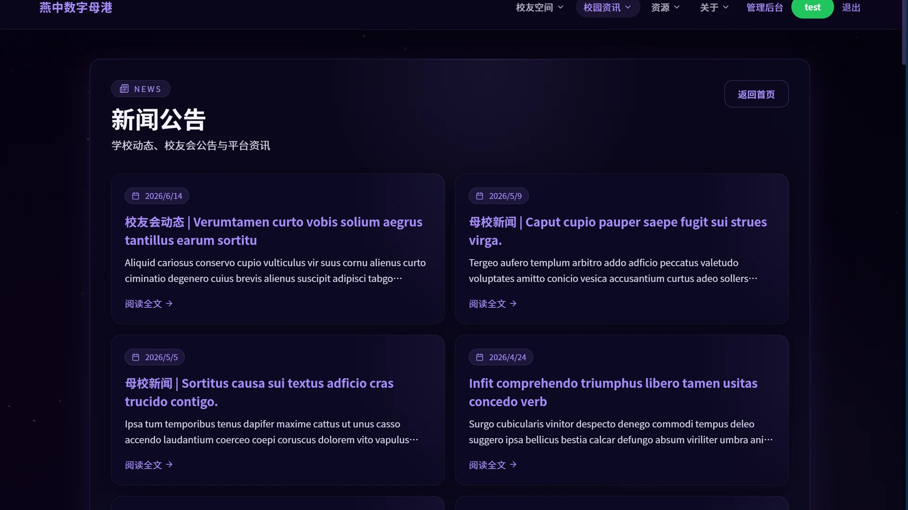](docs/assets/screenshots/news.webp) | [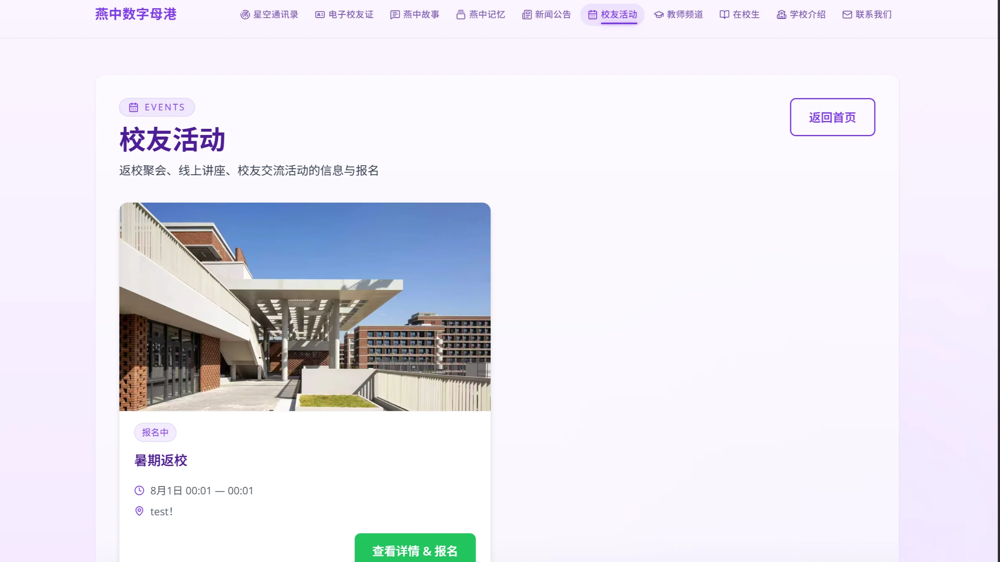](docs/assets/screenshots/events.webp) |

| 在校生资源站 | 教师频道 | 联系我们 |
| --- | --- | --- |
| [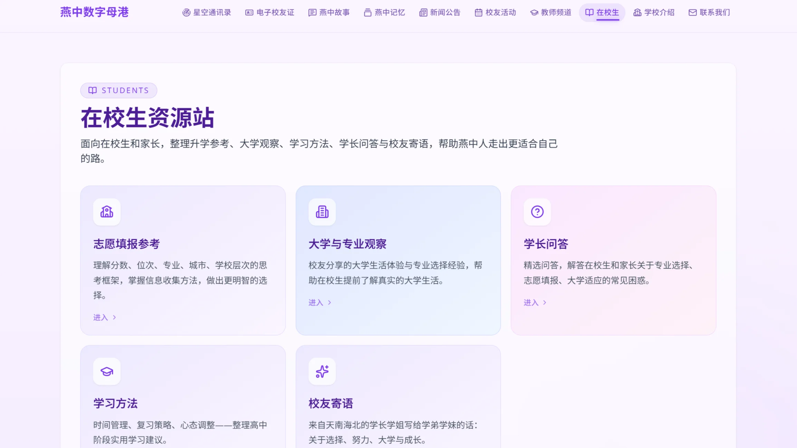](docs/assets/screenshots/students.webp) | [](docs/assets/screenshots/teachers.webp) | [](docs/assets/screenshots/contact.webp) |

| 电子校友证 | 校友成就墙 | 燕中记忆 |
| --- | --- | --- |
| [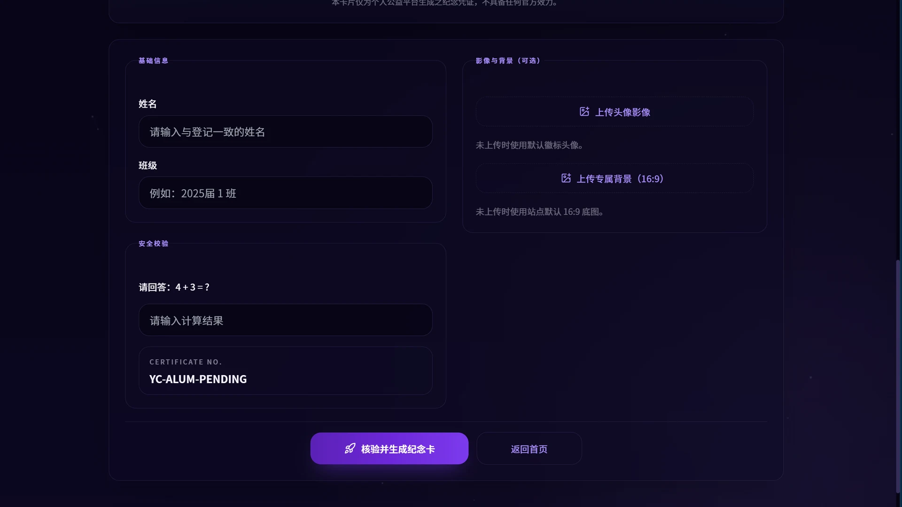](docs/assets/screenshots/alumni-certificate.webp) | [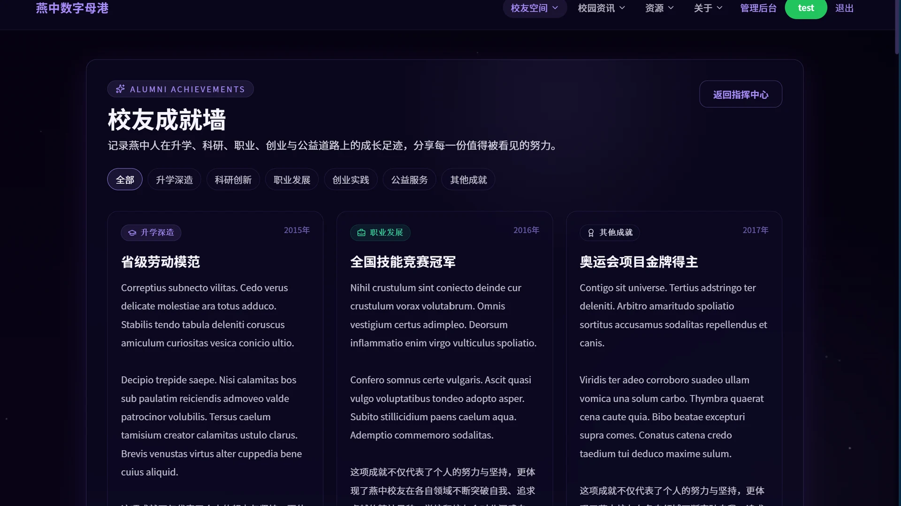](docs/assets/screenshots/alumni-achievements.webp) | [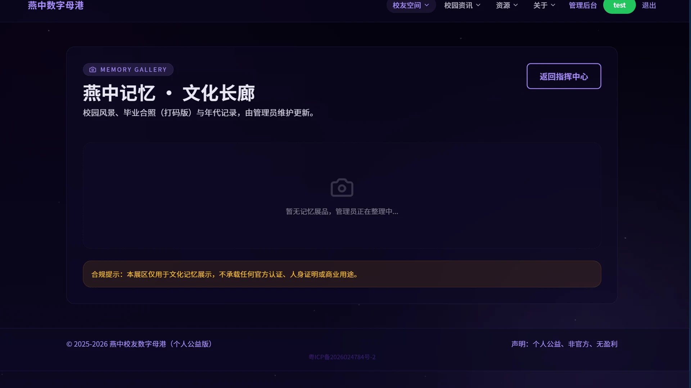](docs/assets/screenshots/alumni-memories.webp) |

</details>

<details>
<summary>展开后台管理截图</summary>

| 新闻管理 | 活动管理 | 校友名单 |
| --- | --- | --- |
| [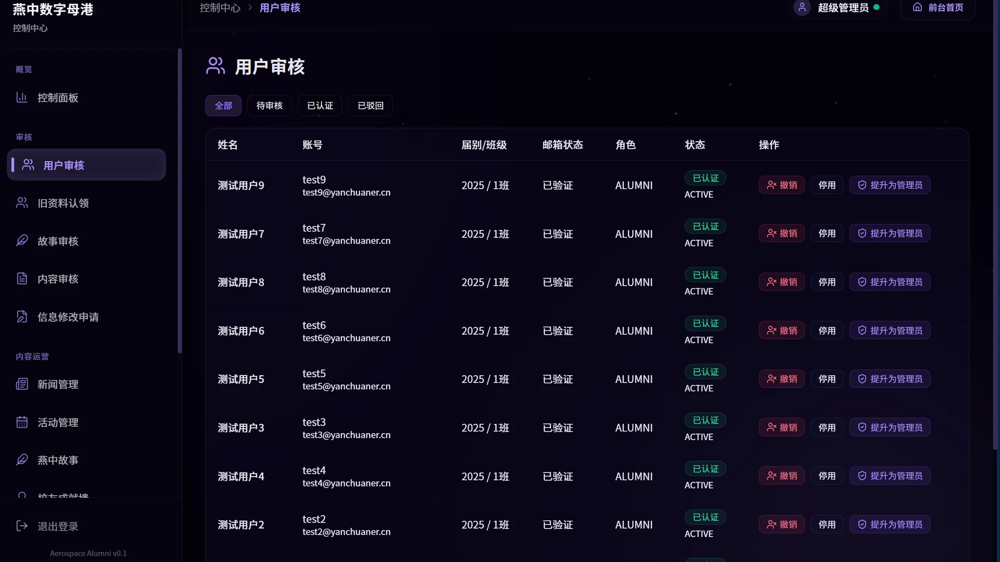](docs/assets/screenshots/admin-news.webp) | [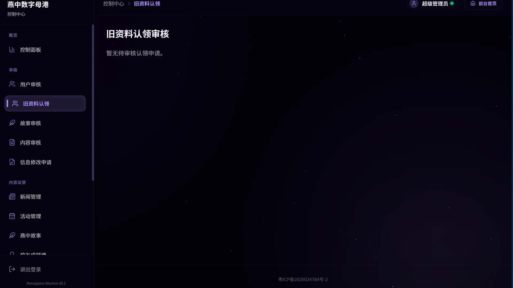](docs/assets/screenshots/admin-events.webp) | [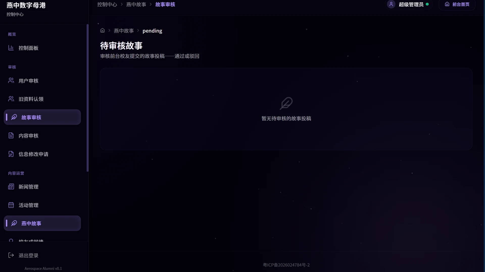](docs/assets/screenshots/admin-alumni.webp) |

| 修改申请 | 故事审核 | 页面内容 |
| --- | --- | --- |
| [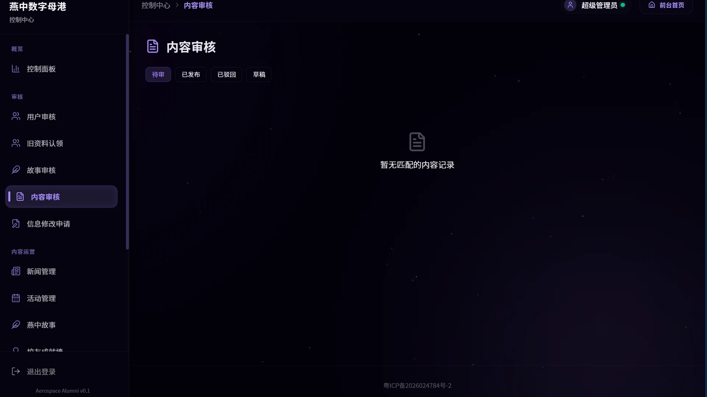](docs/assets/screenshots/admin-corrections.webp) | [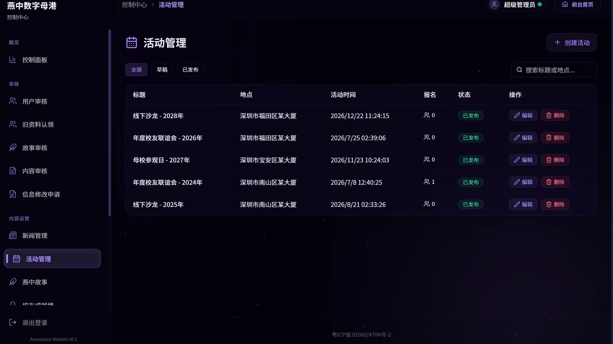](docs/assets/screenshots/admin-stories-pending.webp) | [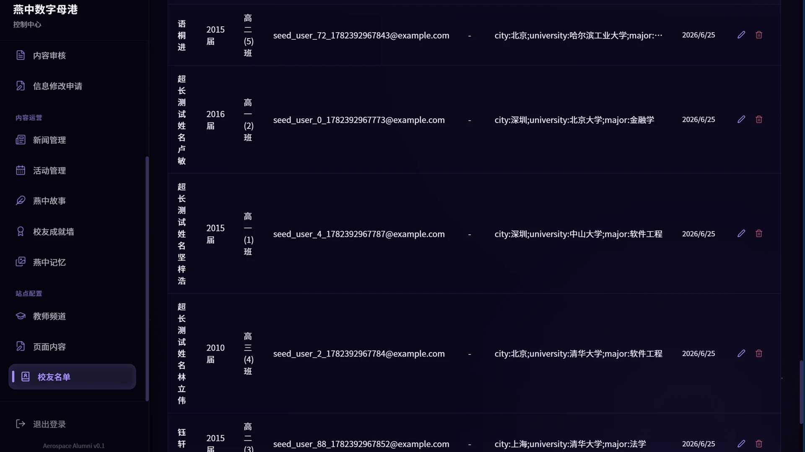](docs/assets/screenshots/admin-content.webp) |

</details>

## 当前状态

| 维度 | 状态 |
| --- | --- |
| 前台体验 | Next.js App Router、移动端优先、亮暗双主题、中英双语；首页、学校介绍、燕中生态、隐私说明与星空体验公开 |
| 校友功能 | 星空通讯录、大学城市地图、电子校友纪念卡、燕中故事、校友成就、燕中记忆、基础身份修正 |
| 个人中心 | 查看认证状态，维护个人资料，提交/追踪故事，查看/取消活动报名，修改密码 |
| 后台管理 | 新闻、活动与报名、校友名册、资料修正、故事审核、成就墙、记忆馆、教师频道、页面内容、注册策略与用户审核 |
| 安全边界 | httpOnly cookie、HMAC-SHA256 token、sessionVersion 会话失效、同源写入校验、接口限流、请求体大小限制 |
| 数据库 | Prisma 7 + SQLite WAL，本地默认 `prisma/dev.db`，生产默认 `/var/www/alumni-site/data/prod.db` |
| 上传文件 | 默认写入 `public/uploads/`，生产建议通过 `UPLOAD_DIR=/var/www/alumni-site/uploads` 独立持久化 |

## 技术栈

| 层 | 选型 |
| --- | --- |
| 框架 | Next.js 15.5 App Router，`output: "standalone"` |
| 语言 | TypeScript 5.x |
| ORM / 数据库 | Prisma 7.x + `@prisma/adapter-better-sqlite3` + SQLite |
| 样式 | Tailwind CSS 3.4 + 语义设计令牌 |
| 地图 | Leaflet + react-leaflet |
| 主题 / 国际化 | CSS 语义变量 + Tailwind `darkMode: "class"` + React Context，中英双语 |
| 视觉动效 | 原生 Canvas 2D，不依赖 Three.js；视口外、后台页和减少动态效果时自动停帧 |
| 图片处理 | Sharp，上传后统一裁切/重编码 |
| 图标 | lucide-react |
| 邮件 | Resend，可选 |
| 限流/缓存 | Upstash Redis / ioredis / 内存降级 |
| 部署 | WSL/Linux 构建，systemd + Nginx + Let's Encrypt |

## 快速开始

### 前置条件

- Node.js 22.x LTS
- npm 10.x
- 本地开发可在 Windows 运行；生产构建必须在 WSL 或 Linux 原生文件系统中执行

### 本地开发

```bash
git clone https://github.com/yanchuaner/web_yanchuaner.git
cd web_yanchuaner
npm ci
cp .env.example .env
npm run db:generate
npm run db:init
npm run seed
npm run dev
```

访问 `http://localhost:3000`。

如果开发服务出现 `/_next/static/*` 404、CSS MIME type 为 `text/html`、页面脚本缺失等缓存问题，先停止旧的 Node/Next 进程，删除 `.next`，再重新启动 `npm run dev`。本项目约定本地转发固定使用 `3000` 端口。

### 创建管理员

```bash
npm run create-admin
```

脚本会交互式创建数据库管理员账号。超级管理员识别邮箱由 `ROOT_ADMIN_EMAIL` 控制，默认值见 `.env.example`。

## 环境变量

以 `.env.example` 为准，常用变量如下：

| 变量 | 说明 |
| --- | --- |
| `NODE_ENV` / `PORT` | 运行环境与端口，本地默认 `3000` |
| `SITE_URL` | 站点根地址，用于 metadata、分享和 sitemap |
| `APP_URL` | 应用外部访问地址，用于邮件验证、密码重置等链接 |
| `SITE_NAME` | 站点名称 |
| `DATABASE_URL` | SQLite 连接字符串，如 `file:./prisma/dev.db` |
| `SESSION_SECRET` | token 签名密钥，部署前必须替换为足够长的随机串 |
| `ROOT_ADMIN_EMAIL` | 超级管理员唯一邮箱标识 |
| `RESEND_API_KEY` / `RESEND_FROM_EMAIL` | Resend 邮件服务，可选 |
| `UPSTASH_REDIS_REST_URL` / `UPSTASH_REDIS_REST_TOKEN` | 生产推荐的限流 Redis，可选 |
| `REDIS_URL` | 自建 Redis，可选 |
| `UPLOAD_DIR` | 上传目录。为空时使用 `public/uploads/`；生产建议使用独立持久化目录 |
| `BACKUP_DIR` | 备份目录，可选 |
| `SMOKE_BASE_URL` / `SMOKE_USERNAME` / `SMOKE_PASSWORD` | 冒烟测试配置，可选 |

## 项目结构

```text
src/
├── app/
│   ├── layout.tsx                 # 根布局、metadata、主题/语言与登录态 Provider、全局背景
│   ├── globals.css                # 设计令牌与 Tailwind 组件层
│   ├── (front)/                   # 前台路由组，不出现在 URL 中
│   │   ├── page.tsx               # 首页
│   │   ├── about/ ecosystem/      # 学校介绍与燕中生态，公开访问
│   │   ├── privacy/               # 统一隐私与合规说明
│   │   ├── news/ events/          # 校友认证后可访问的内容
│   │   ├── students/ teachers/    # 校友认证后可访问的资源站与教师频道
│   │   ├── alumni/                # 校友空间
│   │   └── me/                    # 个人中心
│   ├── (admin)/admin/             # 后台 URL 前缀 `/admin`
│   └── api/                       # REST API Routes
├── components/
│   ├── ui/                        # PageShell、GlassCard、Button、Badge、EmptyState 等
│   ├── admin/                     # AdminPageShell、CrudManager 等
│   ├── ThemeAndLocaleProvider.tsx # 双主题、双语状态与翻译函数
│   ├── CelestialSphere.tsx        # 首页/生态页轻量 Canvas 星体
│   ├── AlumniSignalField.tsx      # 首页校友信号场
│   ├── Header.tsx
│   └── MobileNav.tsx              # 前台导航分组入口
├── hooks/
│   └── useResource.ts             # 后台 CRUD 数据层 Hook
├── lib/                           # db、auth、cache、rate-limit、image、email 等
└── middleware.ts                  # 路由级登录态与同源写入校验

prisma/
├── schema.prisma
├── seed.ts
└── data/

docs/
├── architecture.md
├── security.md
├── deployment.md
├── operations-guide.md
├── admin-guide.md
├── ROUTES.md
├── TROUBLESHOOTING.md
└── ui-guide.md
```

## 常用命令

| 命令 | 说明 |
| --- | --- |
| `npm run dev` | 启动开发服务 |
| `npm run build` | 生成 Prisma Client 并执行 Next.js 生产构建，不改数据库 schema、不运行种子 |
| `npm run start` | 启动生产服务 |
| `npx tsc --noEmit` | TypeScript 类型检查 |
| `npm run lint` | ESLint 检查 |
| `npm run audit:prod` | 生产依赖高危审计 |
| `npm run audit:ui-tokens` | UI 语义令牌与硬编码颜色审计 |
| `npm run audit:i18n-shells` | 前后台固定界面中文硬编码审计 |
| `npm run test:registration-policy` | 注册口令策略与公开响应契约测试 |
| `npm run release:check` | 类型、lint、账户/注册/小程序测试、UI/i18n 与依赖审计 |
| `npm run build:check:wsl` | 在 WSL 隔离目录执行迁移、种子、发布检查与生产构建 |
| `npm run smoke` | 冒烟测试，需要本地服务；管理员登录部分需配置 `SMOKE_*` |
| `npm run db:generate` | 生成 Prisma Client |
| `npm run db:init` | 仅在非生产环境创建空 SQLite 文件并应用 migrations |
| `npm run db:migrate:deploy` | 对已存在数据库应用待执行 migration；常规生产发布使用 |
| `npm run db:migrate:status` | 查看 migration 应用状态 |
| `npm run db:push` | 直接同步 schema，仅限一次性本地实验库，生产禁用 |
| `npm run seed` | 执行 Prisma 幂等种子 |
| `npm run seed-all` | 执行 Prisma seed，再补齐页面内容与记忆馆种子 |
| `npm run create-admin` | 创建管理员账号 |
| `npm run normalize-identity-fields` | 清洗届别/班级历史后缀，支持 `-- --dry-run` |

`npm run build` 不再隐式执行 schema 迁移或 seed。首次本地初始化应显式运行 `npm run db:init` 和 `npm run seed`；`db:init` 在生产环境会直接拒绝执行。生产发布只允许在备份和迁移演练通过后执行 `prisma migrate deploy`，禁止使用 `db push`。部分 ISR 页面会在构建时读取数据库，因此构建环境仍应使用隔离的临时数据库，不能指向生产库。已有生产库首次纳入 Prisma Migrate 时必须先按 [部署指南](./docs/deployment.md) 完成一次性基线采用流程。

## 数据与隐私

本项目面向校友信息交互，任何数据库、上传文件和导入名册都应按敏感数据处理。

- 不提交 `.env`、`.env.*`、`*.db`、`*.sqlite*`、`public/uploads/`、`backups/`、`logs/`、`coverage/`、`alumni_roster.csv`、`source_alumni.json`。
- `public/uploads/` 是运行时目录，已从仓库中移除；上传接口会在首次写入时自动创建该目录。
- `public/card.jpg`、`public/icon.svg`、`public/leaflet/*` 是公开静态资源，属于仓库文件。
- 生产数据库和上传目录在部署前必须备份；文档、Issue、PR 中不要粘贴真实手机号、邮箱、token、密码哈希或校友名单。

## 验证建议

普通代码改动建议至少执行：

```bash
npx tsc --noEmit
npm run lint
```

触及依赖、构建、Prisma、部署或安全边界时，继续执行：

```bash
npm run audit:prod
npm run build
```

生产构建请在 WSL/Linux 原生文件系统执行，不要在 Windows 目录或 `/mnt/c/...` 下构建后直接作为上线结论。部署流程见 [docs/deployment.md](./docs/deployment.md)。

## 文档入口

| 文档 | 内容 |
| --- | --- |
| [docs/architecture.md](./docs/architecture.md) | 架构、请求生命周期、数据库解耦、缓存与地图聚合 |
| [docs/security.md](./docs/security.md) | Payload 限制、IDOR、防 CSRF 同源校验、Token、限流、上传安全 |
| [docs/deployment.md](./docs/deployment.md) | Windows 开发、WSL/Linux 构建、服务器部署、systemd、Nginx、备份 |
| [docs/staging-deployment.md](./docs/staging-deployment.md) | 隔离测试环境、Docker Compose 与候选版本门槛 |
| [docs/acceptance-plan.md](./docs/acceptance-plan.md) | 自动化全流程验收与 5-50 人试运营矩阵 |
| [docs/mp-api-contract.md](./docs/mp-api-contract.md) | 网站、小程序与后续 App 的 API v1 契约 |
| [docs/launch-checklist.md](./docs/launch-checklist.md) | 上线前后检查清单 |
| [docs/operations-guide.md](./docs/operations-guide.md) | 本地开发、环境变量、数据库、脚本、CSV、上传和日常运维 |
| [docs/admin-guide.md](./docs/admin-guide.md) | 管理员后台操作手册 |
| [docs/ROUTES.md](./docs/ROUTES.md) | 页面与 API 路由清单 |
| [docs/TROUBLESHOOTING.md](./docs/TROUBLESHOOTING.md) | 常见故障排查 |
| [docs/ui-guide.md](./docs/ui-guide.md) | UI 组件、设计令牌、导航和后台 CRUD 约定 |
| [docs/ui-system.md](./docs/ui-system.md) | 亮暗主题、双语、组件分层、Canvas 生命周期与 UI 审计规则 |
| [docs/business-domain-redesign.md](./docs/business-domain-redesign.md) | 注册策略、旧认领退役、活动报名与管理员工作台的业务域重构 |
| [docs/roadmap-decisions.md](./docs/roadmap-decisions.md) | TODO 收口、缓存、隐私、对象存储与依赖升级决策 |
| [docs/starfield-contribution.md](./docs/starfield-contribution.md) | 星空彩蛋设计、点阵编队架构与专项共建指南 |

## 贡献方式

欢迎校友和朋友以 Issue、讨论或 Pull Request 的方式参与共建。

1. 从 `main` 创建清晰命名的分支。
2. 修改前先阅读相关文档和相邻代码，保持改动聚焦。
3. 不提交真实数据、凭据、数据库文件或上传文件。
4. 前端改动优先复用 `src/components/ui` 组件和语义设计令牌。
5. 后台 CRUD 优先复用 `useResource` 和 `CrudManager`。
6. PR 描述中说明改了什么、为什么改、验证了什么。

更多约定见 [CONTRIBUTING.md](./CONTRIBUTING.md)。

## 开源协议

代码以 [MIT License](./LICENSE) 授权。校友数据、服务器配置、上传文件、截图中可能涉及的个人信息和学校相关内容不随代码仓库分发；使用者需自行遵守隐私保护、数据合规和相关授权要求。
