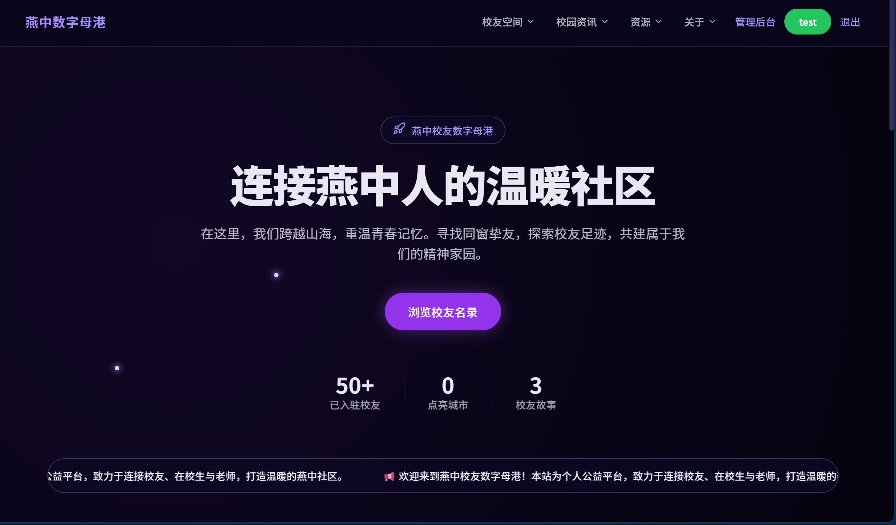
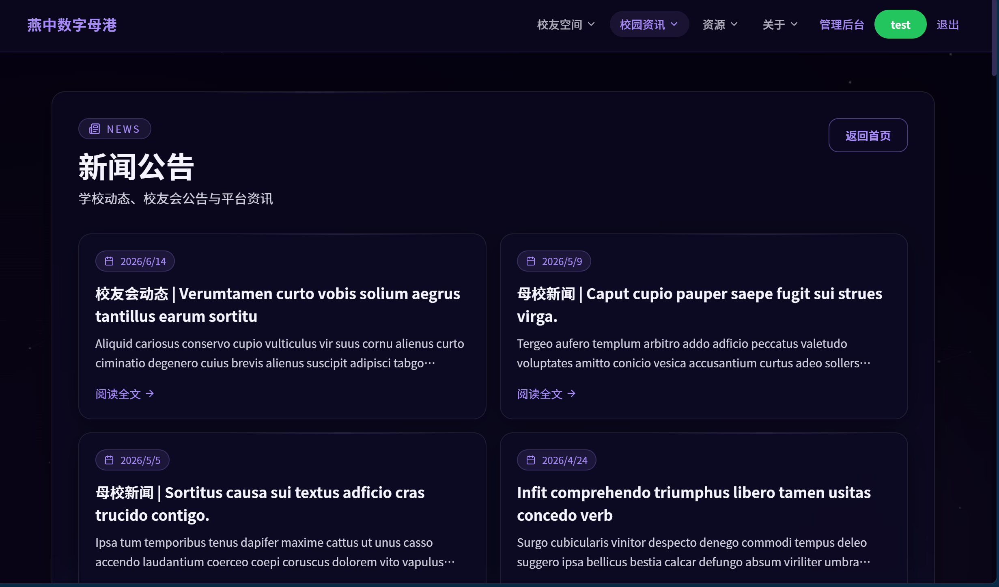
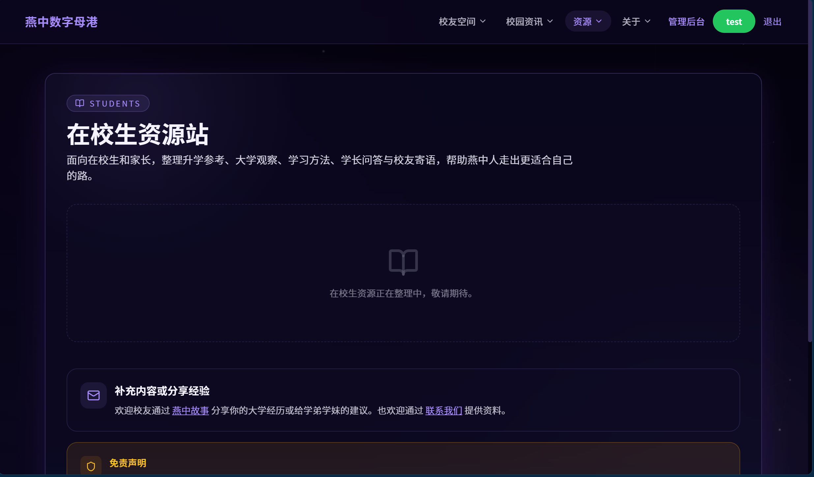
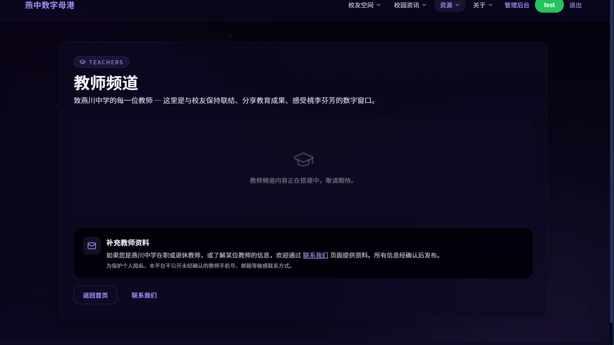
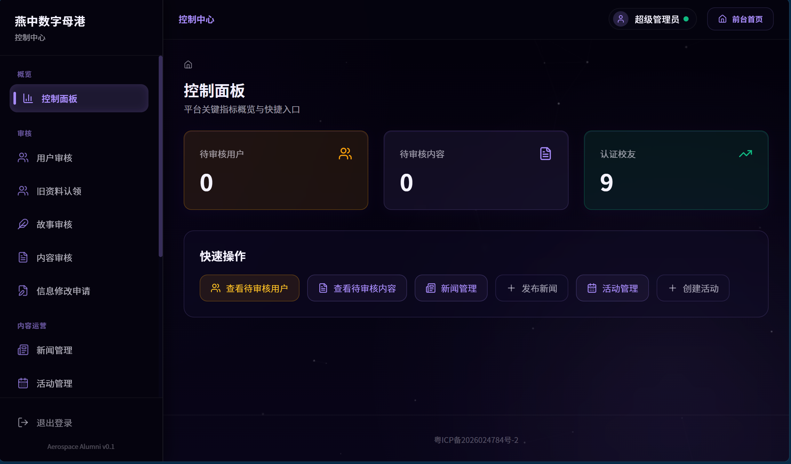
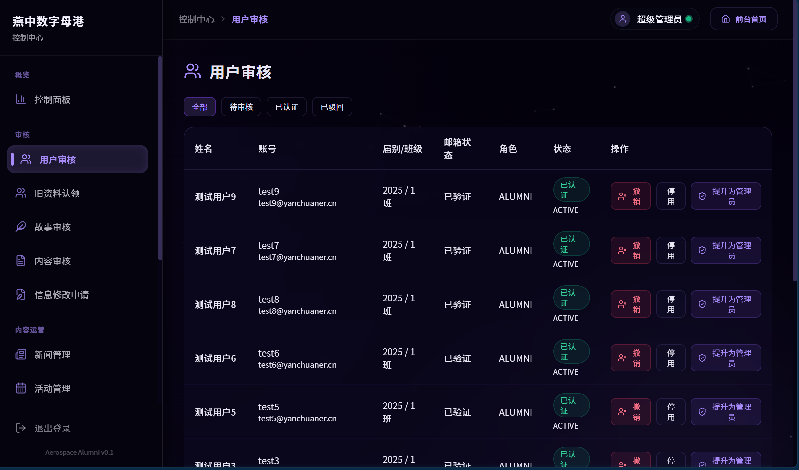
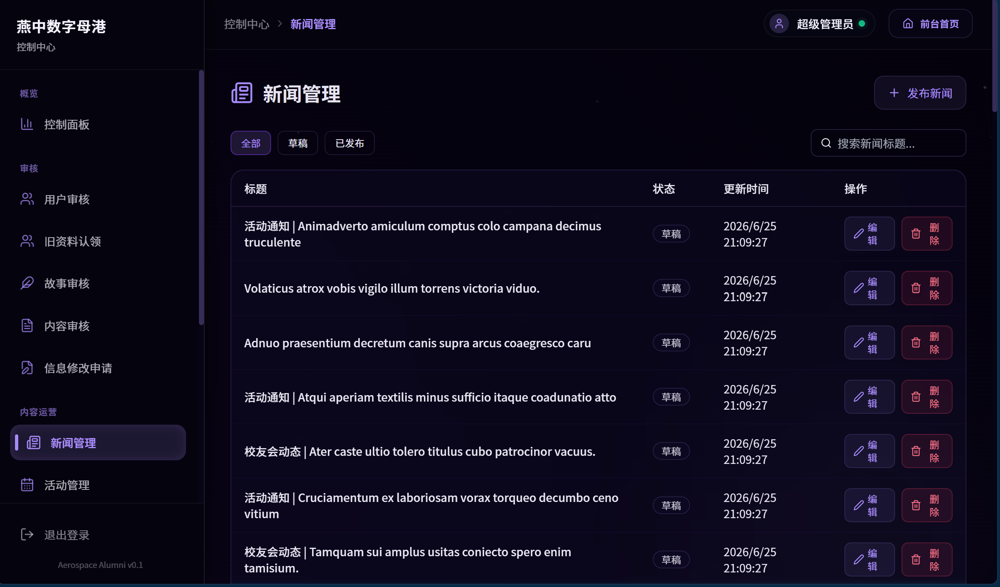
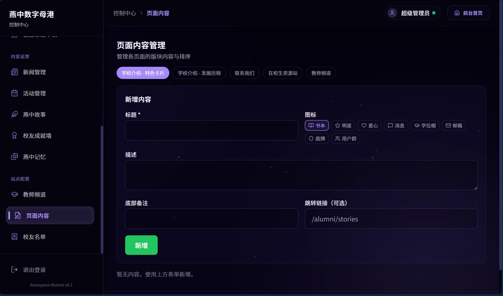

# 燕川中学校友数字母港 (Yanzhong Alumni Hub)

<p align="left">
  
  
  
  
  
  
</p>

**燕川中学校友数字母港** 是一个专为深圳市燕川中学校友、在校师生及管理员设计的公益性数字服务平台。项目采用先进的 **Next.js 14 (App Router)** 独立输出架构构建，融合星空紫暗黑玻璃拟态（Glassmorphism）设计美学，并建立了多维度的 API 安全流控和 SQLite 一致性并发事务防线。

---

## 📸 平台视觉（站点截图）

> 本地开发环境高清无损截图（已完成全站脱敏与暗黑美学适配），点击图片可查看高清晰度原图。

### 🏛️ 前台大堂与星空走廊
| | | |
|:---:|:---:|:---:|
| [](docs/assets/screenshots/home.png) | [](docs/assets/screenshots/about.png) | [](docs/assets/screenshots/news.png) |
| **星空大堂（首页）** | **百年燕中（关于母校）** | **校园公告与新闻资讯** |
| [](docs/assets/screenshots/students.png) | [](docs/assets/screenshots/teachers.webp) | [](docs/assets/screenshots/contact.webp) |
| **在校生互助资源站** | **筑梦师长（教师频道）** | **互通有无（联系我们）** |

### 🚀 校友专属服务终端
| | | |
|:---:|:---:|:---:|
| [](docs/assets/screenshots/alumni-space.png) | [](docs/assets/screenshots/stories.webp) | [](docs/assets/screenshots/certificate.webp) |
| **校友地图空间（聚合分布）** | **燕中岁月故事专栏 (CMS)** | **电子校友纪念卡** |

### 🛠️ 管理员控制中心
| | | |
|:---:|:---:|:---:|
| [](docs/assets/screenshots/admin-overview.png) | [](docs/assets/screenshots/admin-audit.png) | [](docs/assets/screenshots/admin-content.png) |
| **后台控制台（概览中心）** | **审核工作台（校友/故事）** | **内容运营工作台（运营发布）** |
| [](docs/assets/screenshots/admin-config.png) | | |
| **站点通用配置管理** | | |

---

## 🌟 核心系统特性

*   **🌌 星空紫暗黑玻璃拟态美学**：全局基于 Tailwind CSS 构建。前台统一采用半透明深紫 `bg-slate-900/50` 与细致描边 `border-purple-500/30` 营造的磨砂毛玻璃滤镜（`backdrop-blur-xl`），并与后台全局暗色实体背景完美融合。
*   **🔒 高安全性多级 RBAC 体系**：
    *   引入基于 Session / Token 的底层严密校验，彻底避免水平越权攻击（IDOR）。
    *   专设超级管理员（Root Admin）防线，阻断普通管理员同级越权停用或篡改。
*   **🛡️ 黄金 API 健壮性防线**：
    *   **流式 Payload 大小熔断**：重构普通的 `req.json()` 提取为 `readJsonBody(req, limit)` 熔断器，分级防御（普通接口 16KB / 媒体富文本接口 512KB），杜绝服务器内存耗尽（OOM）。
    *   **参数强校验与 Take 限制**：分页逻辑深度验证 NaN 与负数；未分页的查询接口默认加锁 `take: 200`，有效避免全表扫描拖垮系统。
*   **💾 并发事务与脱敏设计**：
    *   **SQLite 写入防死锁**：针对名单导入、状态变更等高频 I/O，采用 `prisma.$transaction` 打包为单一写事务提交，完美化解 SQLite 高频锁定磁盘引发的应用阻塞与死锁。
    *   **数据细粒度脱敏**：数据检索查询全面使用 `select` 显式投射，从数据库层面阻隔密码哈希、会话 token 等敏感信息的下发。
*   **📐 优雅的前端工程化解耦**：
    *   使用全局统一的设计令牌（Design Tokens）和基础组件包（`components/ui`）。
    *   抽离后台数据层交互，提供高内聚的抽象挂钩（`useResource` + `CrudManager`），实现 UI 渲染和状态管理的深度解耦。

---

## 🛠️ 技术栈清单

| 层级 | 技术选型 | 功能说明 |
| --- | --- | --- |
| **核心框架** | Next.js 14.2 (App Router) | 支持 standalone 独立静态编译与服务端动态路由 |
| **开发语言** | TypeScript 5.x | 全局强类型健壮覆盖与编译约束 |
| **对象关系映射** | Prisma 7.x | 强类型数据查询层与 Schema 管理 |
| **数据库** | SQLite 3 (`better-sqlite3`) | 单文件轻量级关系数据库，高并发事务优化 |
| **CSS 样式** | Tailwind CSS 3.4 | 设计令牌驱动的高级玻璃美学交互与自适应断点 |
| **电子地图** | Leaflet + `react-leaflet` | 离线 / 在线校友城市热力分布与统计网格 |
| **媒体处理** | Sharp 0.34 | 支持上传图片自动裁切、高压缩比 WebP 管道转换 |
| **安全发信** | Resend API | 生产环境高效发信与自适应防爆破策略 |

---

## 📂 项目结构指南

```text
aerospace-alumni-site/
├── src/
│   ├── app/                          # Next.js 路由与 API 主阵地
│   │   ├── (front)/                  # 前台路由组（高空星空紫美学主题）
│   │   │   ├── page.tsx              # 首页
│   │   │   ├── about/                # 关于母校
│   │   │   ├── news/                 # 新闻资讯
│   │   │   ├── events/               # 校友活动
│   │   │   ├── contact/              # 联系我们
│   │   │   ├── teachers/             # 筑梦师长
│   │   │   ├── students/             # 在校生资源站
│   │   │   ├── alumni/               # 校友专属页（地图、故事、纪念证等）
│   │   │   ├── login/                # 统一登录
│   │   │   ├── register/             # 用户注册
│   │   │   ├── verify-email/         # 邮箱安全验证
│   │   │   └── me/                   # 个人中心（含资料 Combobox 模糊选择与投稿管理）
│   │   ├── (admin)/                  # 管理员后台路由组
│   │   │   └── admin/                # 后台管理终端（18个子项如：概览、名单、审计日志、审核中心）
│   │   └── api/                      # API 端点核心逻辑（40+ 路由防御网）
│   ├── components/                   # React 业务组件库
│   │   ├── ui/                        # 原子级 UI 美学组件库（PageShell / GlassCard / Badge 等）
│   │   └── admin/                     # 管理端通用 CrudManager 抽象组件
│   ├── hooks/                        # 自定义 Hooks（数据挂钩与状态）
│   ├── lib/                          # 核心工具库（鉴权工具、文件移动保护、发信配置等）
│   └── middleware.ts                 # 统一权限与安全防护中间件
├── prisma/
│   └── schema.prisma                 # 数据库关系 Schema 与索引优化
├── prisma.config.ts                  # Prisma 连接驱动定义
├── public/                           # 静态资源与图片资产
├── scripts/                          # 批量生成、自动化备份、测试等运维脚本
├── docs/                             # 结构化架构设计与运维手册文档
├── Dockerfile                        # 多阶段 standalone Docker 构建文件
└── tailwind.config.ts                # 颜色令牌与断点定义
```

---

## 🚀 快速启动指南

### 环境依赖
*   Node.js 20+ 或 22+
*   npm 10+
*   WSL / Linux 容器运行环境（以支持 Next.js Standalone 生产编译）

### 极速部署运行
```bash
# 1. 拷贝仓库并安装依赖
git clone https://github.com/yanchuaner/web_yanchuaner.git
cd web_yanchuaner
npm ci

# 2. 初始化环境变量
cp .env.example .env
# 根据部署环境编辑 .env 文件配置相关变量

# 3. 生成 Prisma 客户端并初始化 SQLite schema
npm run db:generate
npm run db:push

# 4. 初始化种子数据（快速填充文章内容与名册白名单）
npm run db:seed

# 5. 创建超级管理员账号
npm run create-admin

# 6. 运行本地开发服务器
npm run dev
```
打开浏览器访问 [http://localhost:3000](http://localhost:3000) 即可预览。

---

## 📌 核心日常指令

| 任务指令 | 作用说明 |
| --- | --- |
| `npm run dev` | 启动开发服务环境（监听 3000 端口，支持热重载） |
| `npm run build` | 编译打包生产资源（standalone 独立包模式） |
| `npm run start` | 启动 standalone 生产环境服务进程 |
| `npm run lint` | ESLint 静态代码风格与规范校验 |
| `npx prisma studio` | 在浏览器中打开本地 Prisma 数据库查看工具 |
| `npm run smoke` | 执行核心路由安全性路径冒烟测试 |
| `bash scripts/backup.sh` | 数据库本地物理快照与关键媒体资源归档备份 |

---

## 🛡️ 安全合规与生产指南

1.  **敏感操作审计**：系统会对所有管理员账号在后台的工作流行为自动向 `AuditLog` 写入行为快照，以便在系统合规审查中进行追溯。
2.  **图片防爆**：所有后台图片上传通过 `Sharp` 进行预裁切与自适应转换（固定为 WebP 格式及 16:9 比例），保障页面的排版一致性及首屏加载效率。
3.  **配置备份**：部署时建议在 Linux 中将 `/var/www/alumni-site/data/prod.db` 目录写入 cron 定时任务，利用 `scripts/backup.sh` 进行自动冷备。

---

## 🤝 贡献指南
欢迎所有校友共建者提交 Issue 或 Pull Request！我们遵循标准的 Git 分支工作流，请将您的 Feature 分支合并指向 `feather` 联调分支进行发布测试。

## 📄 开源许可证
本项目采用 [MIT License](LICENSE) 授权，仅用于个人公益及非商业性校友联络平台构建。
