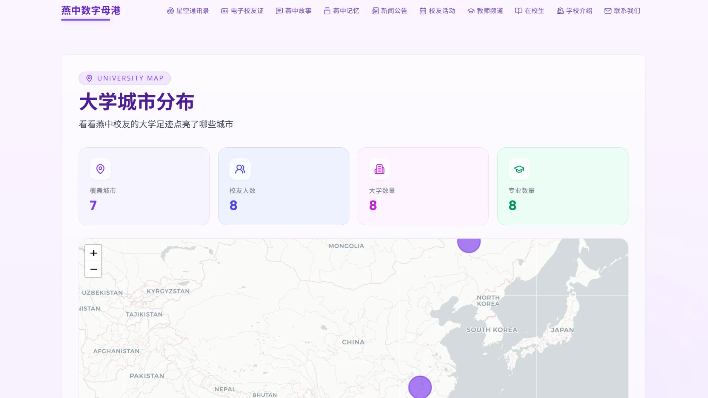
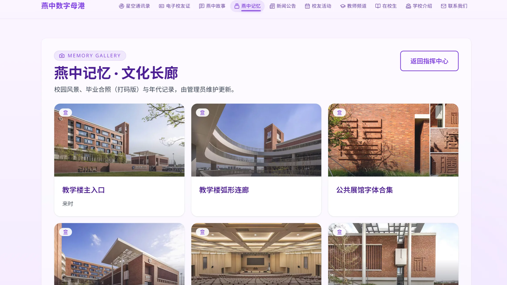
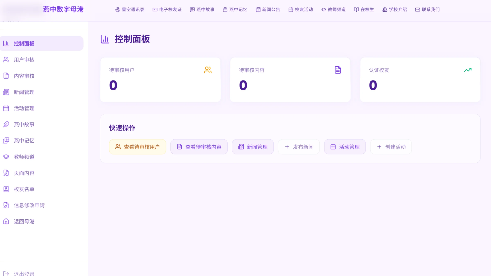

# 燕川中学校友数字母港 (Yanzhong Alumni Hub)

<p align="left">
  
  
  
  
  
  
</p>

公益、非官方的深圳市燕川中学校友会数字平台。基于 Next.js 14 App Router、Prisma 7.x + SQLite 数据层、HMAC-SHA256 鉴权、Sharp 图像处理与后台管理能力构建。

> 面向校友、在校生和管理员的公益站点，提供新闻、活动、电子校友证、文化记忆长廊、校友地图、故事投稿、校友名单、审核与后台管理等功能。

## 目录

- [核心能力](#核心能力)
- [技术栈](#技术栈)
- [项目结构](#项目结构)
- [快速开始](#快速开始)
- [常用命令](#常用命令)
- [数据模型](#数据模型)
- [主要路由](#主要路由)
- [部署](#部署)
- [文档](#文档)
- [贡献指南](#贡献指南)
- [许可证](#许可证)
- [站点截图](#站点截图)

## 核心能力

| 模块 | 能力 |
| --- | --- |
| 前台 | 首页、新闻、活动、燕中记忆文化长廊、校友城市分布地图、燕中故事、校友成就墙、在校生资源站、教师频道、学校介绍、联系我们 |
| 后台 | 新闻管理、活动管理、校友名单（CRUD/导入/导出/证书编号）、燕中记忆管理、燕中故事管理、校友成就墙管理、页面内容管理（教师频道/学校介绍/联系我们/在校生）、修改申请审核、投稿管理、用户管理 |
| 数据 | Prisma 7.x + SQLite，10 个数据模型，本地和生产均使用 SQLite 文件持久化 |
| 认证 | 普通访问口令（httpOnly cookie）+ 管理员登录（HMAC-SHA256 token），各自独立鉴权 |
| 图片 | 管理员上传图片自动 16:9 裁切（Sharp），新闻/活动/记忆展品封面统一规格 |
| 地图 | 校友大学城市分布（Leaflet 地图 + 城市聚合统计 + 校友明细） |
| 安全 | API 限流（内存/Redis）、CSV 导出防公式注入、httpOnly cookie、凭据脚本一键轮换 |

## 站点截图

> 以下截图来自本地开发环境，已做脱敏处理。点击图片可查看原尺寸。

<div align="center">

| | | |
|:---:|:---:|:---:|
|  |  |  |
| **首页总览** | **校友活动** | **星空通讯录（校友地图）** |
|  |  |  |
| **燕中记忆文化长廊** | **燕中故事** | **电子校友纪念卡** |
|  |  |  |
| **新闻公告** | **后台管理** | **学校介绍** |

</div>

<details>
<summary>更多页面截图</summary>

| | | |
|:---:|:---:|:---:|
|  |  |  |
| **在校生资源站** | **教师频道** | **联系我们** |

</details>

## 技术栈

| 层级 | 技术 | 版本 |
| --- | --- | --- |
| 框架 | Next.js (App Router, standalone output) | 14.2 |
| 语言 | TypeScript | 5.x |
| ORM | Prisma | 7.x |
| 数据库 | SQLite (better-sqlite3) | 3 |
| 样式 | Tailwind CSS | 3.4 |
| 地图 | Leaflet + react-leaflet | 1.9.4 |
| 图像处理 | Sharp | 0.34 |
| 认证 | HMAC-SHA256 + httpOnly cookie | — |
| 部署 | systemd + Nginx + Let's Encrypt | — |

## 项目结构

```text
aerospace-alumni-site/
├── src/
│   ├── app/                          # Next.js App Router
│   │   ├── page.tsx                  # 首页
│   │   ├── layout.tsx                # 根布局
│   │   ├── globals.css               # 全局样式
│   │   ├── about/                    # 学校介绍
│   │   ├── news/                     # 新闻列表/详情
│   │   ├── events/                   # 活动列表/详情/报名
│   │   ├── contact/                  # 联系我们
│   │   ├── teachers/                 # 教师频道
│   │   ├── students/                 # 在校生资源站（5 个子页）
│   │   ├── alumni/                   # 校友相关（证书、地图、记忆、故事、修改申请）
│   │   ├── admin/                    # 后台管理（含燕中记忆、故事、教师频道、内容管理）
│   │   └── api/                      # API 路由（40+ 个端点）
│   ├── components/                   # React 通用组件（12 个）
│   ├── data/                         # 静态数据（城市坐标、故事 JSON、种子数据）
│   ├── lib/                          # 工具库
│   │   ├── db.ts                     # Prisma 客户端
│   │   ├── admin-auth.ts             # 管理员鉴权
│   │   ├── verify-token.ts           # Token 验证
│   │   ├── cache.ts                  # 缓存（Redis/内存）
│   │   ├── redis.ts                  # Redis 客户端
│   │   ├── rate-limit.ts             # API 限流
│   │   ├── image-pipeline.ts         # 图片处理管道（Sharp）
│   │   ├── tags.ts                   # Tags 解析与标准化
│   │   └── memories.ts               # 记忆板块文件重命名
│   └── middleware.ts                 # 路由中间件（认证）
├── prisma/
│   └── schema.prisma                 # 数据模型定义（12 个模型）
├── prisma.config.ts                  # Prisma 7.x 数据源配置
├── public/                           # 静态资源（图片、Leaflet 图标、上传文件）
├── scripts/                          # 运维脚本（13 个）
├── docs/                             # 项目文档（8 个文件）
├── .env.example                      # 环境变量模板
├── credentials.example.json          # 凭据脚本模板
├── Dockerfile                        # Docker 多阶段构建
├── docker-compose.yml                # Docker Compose 编排
├── next.config.mjs                   # Next.js 配置
├── tailwind.config.ts                # Tailwind 配置
└── package.json
```

## 快速开始

### 系统要求

- Node.js 20+ 或 22+
- npm 10+
- Git
- 推荐 WSL/Linux 进行生产构建（Windows 下 `next build` 不完全兼容）

### 安装与启动

```bash
git clone https://github.com/yanchuaner/web_yanchuaner.git
cd web_yanchuaner

# 1. 安装依赖（严格按 lockfile）
npm ci

# 2. 配置环境变量
cp .env.example .env
# 编辑 .env，填入凭据（参考 docs/OPERATIONS_GUIDE.md）

# 3. 初始化数据库
DATABASE_URL="file:./dev.db" npx prisma generate
DATABASE_URL="file:./dev.db" npx prisma db push

# 4. （可选）种子数据初始化
node scripts/seed_whitelist.js        # 校友名单（107 条）
node scripts/seed_memories.js         # 燕中记忆展品（6 条）
node scripts/seed_content_sections.js # 页面内容（about/contact/students/teachers）
node scripts/seed_stories.js          # 燕中故事（3 条）

# 5. 启动开发服务器
npm run dev
```

打开 [http://localhost:3000](http://localhost:3000) 即可。

### 默认入口

- 首页：[http://localhost:3000](http://localhost:3000)
- 管理员登录：[http://localhost:3000/admin/login](http://localhost:3000/admin/login)
- 燕中记忆文化长廊：[http://localhost:3000/alumni/memories](http://localhost:3000/alumni/memories)
- 电子校友纪念卡：[http://localhost:3000/alumni/certificate](http://localhost:3000/alumni/certificate)
- 校友地图：[http://localhost:3000/alumni/university-map](http://localhost:3000/alumni/university-map)

## 常用命令

| 命令 | 作用 |
| --- | --- |
| `npm run dev` | 启动开发服务器（localhost:3000） |
| `npm run build` | 生产构建（standalone 模式） |
| `npm run start` | 启动生产服务 |
| `npm run lint` | ESLint 静态检查 |
| `npx prisma generate` | 生成 Prisma Client |
| `DATABASE_URL="file:./dev.db" npx prisma db push` | 同步数据库 schema |
| `npx prisma studio` | 打开 Prisma 数据库浏览器 |
| `node scripts/smoke-test.js` | 关键路径回归测试 |
| `node scripts/set-credentials.js` | 一键更新访问口令和管理员账号密码 |
| `node scripts/gen_cert_numbers.js` | 批量生成校友证书编号 |
| `node scripts/seed_whitelist.js` | 初始化校友名单（107 条） |
| `node scripts/seed_memories.js` | 初始化燕中记忆种子数据 |
| `node scripts/seed_content_sections.js` | 初始化页面内容数据 |
| `node scripts/seed_stories.js` | 初始化燕中故事数据 |
| `bash scripts/backup.sh` | 备份数据库 + 上传文件 |

### 30 秒修改凭证

```bash
cp credentials.example.json credentials.local.json
# 编辑 credentials.local.json 填写新值
node scripts/set-credentials.js
```

脚本特性：原子写入防半写损坏、自动备份支持回滚、敏感文件已加入 `.gitignore`。修改后需重启服务。

## 数据模型

| 模型 | 说明 | 主要字段 |
| --- | --- | --- |
| `User` | 用户 | name, contact, role(GUEST/ADMIN), status(PENDING/APPROVED) |
| `WhitelistRoster` | 校友名单 | name, graduationClass, tags（大学\|专业\|城市）, certificateNo |
| `News` | 新闻 | title, summary, content, imageUrl, status(DRAFT/PUBLISHED) |
| `Event` | 活动 | title, summary, content, location, eventDate, maxAttendees, status |
| `EventRegistration` | 活动报名 | eventId, name, contact, message |
| `AlumniCorrectionRequest` | 校友信息修改申请 | rosterId, 当前值与申请值对比, status(PENDING/APPROVED/REJECTED) |
| `Post` | 投稿 | title, content, type, status(DRAFT/PUBLISHED), authorId |
| `Story` | 燕中故事 | title, author, tags(JSON), body, date |
| `Achievement` | 校友成就 | alumniName, graduationClass, title, category, description, organization, yearLabel, status, sortOrder |
| `MemoryItem` | 燕中记忆展品 | title, subtitle, description, imagePath, imageAlt, icon, sortOrder |
| `ContentSection` | 页面内容块 | page(页面标识), title, description, note, icon, href, actionLabel, yearLabel, sortOrder |
| `TeacherSection` | 教师频道版块 | title, description, note, icon, href, actionLabel, sortOrder |

## 主要路由

| 路由 | 权限 | 说明 |
| --- | --- | --- |
| `/` | 普通口令 | 首页 |
| `/about` | 公开 | 学校介绍 |
| `/news` | 公开 | 新闻列表 |
| `/events` | 公开 | 活动列表 |
| `/alumni/certificate` | 普通口令 | 电子校友纪念卡 |
| `/alumni/university-map` | 普通口令 | 校友大学城市分布地图 |
| `/alumni/memories` | 普通口令 | 燕中记忆文化长廊（数据库驱动） |
| `/alumni/stories` | 普通口令 | 燕中故事（数据库驱动 + 邮箱投稿） |
| `/alumni/achievements` | 普通口令 | 校友成就墙（类别筛选，仅展示已发布内容） |
| `/alumni/correction` | 普通口令 | 校友信息修改申请 |
| `/students` | 公开 | 在校生资源站（数据库驱动） |
| `/teachers` | 公开 | 教师频道（数据库驱动） |
| `/contact` | 公开 | 联系我们（数据库驱动） |
| `/about` | 公开 | 学校介绍（数据库驱动） |
| `/admin/login` | 公开 | 管理员登录 |
| `/admin` | 管理员 | 后台控制面板 |
| `/admin/news` | 管理员 | 新闻管理 |
| `/admin/events` | 管理员 | 活动管理（含报名名单） |
| `/admin/memories` | 管理员 | 燕中记忆管理（CRUD/排序/上传） |
| `/admin/stories` | 管理员 | 燕中故事管理（CRUD） |
| `/admin/achievements` | 管理员 | 校友成就墙管理（CRUD/发布状态/排序） |
| `/admin/teachers` | 管理员 | 教师频道管理 |
| `/admin/content` | 管理员 | 页面内容管理（about/contact/students/teachers） |

完整路由与 API 权限说明见 [docs/ROUTES.md](docs/ROUTES.md)。

## 部署

### 本地预览

```bash
npm run build
node .next/standalone/server.js
```

默认监听 `PORT=3000`，可通过环境变量修改端口。

### 生产部署

详细流程见 [docs/DEPLOYMENT_GUIDE.md](docs/DEPLOYMENT_GUIDE.md)。简要步骤：

1. WSL 中执行 `npm run build` 生成 `deploy/` 目录
2. 上传到服务器 `/var/www/alumni-site/app`
3. 配置 systemd 服务、Nginx 反向代理、Let's Encrypt 证书
4. 启动 `systemctl start alumni-site`

### Docker 部署

```bash
docker compose up -d
```

详见 [Dockerfile](Dockerfile) 和 [docker-compose.yml](docker-compose.yml)。

### 环境要求

- 本地开发：Windows / macOS / Linux
- 生产构建：**必须在 WSL 或 Linux 中执行**
- 生产运行：Node.js 20+ + systemd + Nginx
- 数据库：SQLite（生产路径 `/var/www/alumni-site/data/prod.db`）
- 内存：≥ 2GB（生产构建需 4GB+，运行需 1GB+）

## 文档

| 文档 | 说明 |
| --- | --- |
| [docs/README.md](docs/README.md) | 文档总览与阅读顺序 |
| [docs/PROJECT_OVERVIEW.md](docs/PROJECT_OVERVIEW.md) | 项目结构、功能清单、技术栈、安全边界 |
| [docs/ROUTES.md](docs/ROUTES.md) | 页面与 API 路由清单（含权限标记） |
| [docs/ADMIN_GUIDE.md](docs/ADMIN_GUIDE.md) | 后台使用手册（操作步骤） |
| [docs/OPERATIONS_GUIDE.md](docs/OPERATIONS_GUIDE.md) | 本地开发、环境变量、脚本、数据库操作 |
| [docs/DEPLOYMENT_GUIDE.md](docs/DEPLOYMENT_GUIDE.md) | 构建、部署、Nginx、HTTPS、systemd |
| [docs/BACKUP_GUIDE.md](docs/BACKUP_GUIDE.md) | 备份策略、恢复流程、离线备份 |
| [docs/TROUBLESHOOTING.md](docs/TROUBLESHOOTING.md) | 常见问题排查与修复方案 |
| [CONTRIBUTING.md](CONTRIBUTING.md) | 贡献指南 |
| [CHANGELOG.md](CHANGELOG.md) | 版本变更记录 |

## 贡献指南

欢迎贡献！在提交 Pull Request 前请阅读 [CONTRIBUTING.md](CONTRIBUTING.md)。

简要流程：

1. Fork 本仓库
2. 从 `feather` 分支创建特性分支 (`git checkout -b feat/awesome-feature`)
3. 提交变更 (`git commit -m 'feat: add awesome feature'`)
4. 推送分支 (`git push origin feat/awesome-feature`)
5. 向 `feather` 分支创建 Pull Request

## 许可证

本项目采用 [MIT License](LICENSE)，可自由用于学习和非商业用途。本项目为校友会公益展示平台，非官方发布，不用于商业用途。

## 致谢

感谢所有平台共建者的贡献。本项目纯公益，不涉及任何商业利益。

---

**项目地址**：[https://github.com/yanchuaner/web_yanchuaner](https://github.com/yanchuaner/web_yanchuaner)
**线上站点**：[https://yanchuaner.cn](https://yanchuaner.cn)
